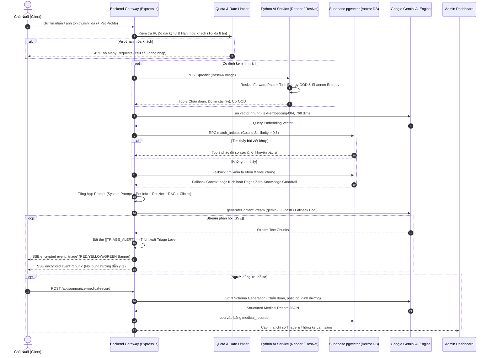

# 🐾 Vethic AI - Tài Liệu Kiến Trúc AI, Luồng Thực Thi & Cẩm Nang Quản Trị Hệ Thống

> **Phiên bản tài liệu**: 2.5 (Cập nhật chuẩn kiểm định chuyên gia 2026)  
> **Dự án**: Vethic AI - Hệ thống Trợ lý Thú y & Triage Y tế Thông minh  
> **Phạm vi tài liệu**: Mô tả chi tiết toàn bộ luồng thực thi AI đa phương thức (Multimodal AI Flow), danh mục công nghệ kỹ thuật (Tech Stack), và các tác vụ vận hành quản trị chuyên sâu của Admin (Kiểm định độ chính xác, Quản lý Key Pool, Giám sát API & Keep-Alive).

---

## 📑 Mục Lục
1. [Tổng Quan Hệ Thống (System Overview)](#1-tổng-quan-hệ-thống-system-overview)
2. [Luồng Thực Thi AI Chi Tiết (End-to-End AI Execution Flow)](#2-luồng-thực-thi-ai-chi-tiết-end-to-end-ai-execution-flow)
   - [2.1 Sơ đồ tuần tự tổng thể (Mermaid Architecture Flow)](#21-sơ-đồ-tuần-tự-tổng-thể-mermaid-architecture-flow)
   - [2.2 Tiền xử lý & Kiểm soát hạn ngạch (Pre-flight & Quota Guard)](#22-tiền-xử-lý--kiểm-soát-hạn-ngạch-pre-flight--quota-guard)
   - [2.3 Chẩn đoán thị giác máy tính da liễu (Computer Vision via ResNet)](#23-chẩn-đoán-thị-giác-máy-tính-da-liễu-computer-vision-via-resnet)
   - [2.4 Cơ chế phát hiện bệnh lạ ngoài danh mục (Energy-Based OOD & Shannon Entropy)](#24-cơ-chế-phát-hiện-bệnh-lạ-ngoài-danh-mục-energy-based-ood--shannon-entropy)
   - [2.5 Truy xuất tri thức ngữ nghĩa RAG (Semantic pgvector & Fallback)](#25-truy-xuất-tri-thức-ngữ-nghĩa-rag-semantic-pgvector--fallback)
   - [2.6 Tổng hợp Prompt, Khối Triage và Streaming SSE](#26-tổng-hợp-prompt-khối-triage-và-streaming-sse)
   - [2.7 Tự động trích xuất Hồ sơ Bệnh án Điện tử (EHR Generation)](#27-tự-động-trích-xuất-hồ-sơ-bệnh-án-điện-tử-ehr-generation)
3. [Các Công Nghệ Được Sử Dụng (Technologies & Tech Stack)](#3-các-công-nghệ-được-sử-dụng-technologies--tech-stack)
   - [3.1 Bảng tổng hợp công nghệ](#31-bảng-tổng-hợp-công-nghệ)
   - [3.2 Phân tầng kiến trúc (Architecture Layers)](#32-phân-tầng-kiến-trúc-architecture-layers)
4. [Các Tác Vụ Quản Trị Của Admin (Admin Operations & Diagnostics)](#4-các-tác-vụ-quản-trị-của-admin-admin-operations--diagnostics)
   - [4.1 Chẩn đoán & Kiểm định độ chính xác AI (AI Evaluation & Benchmark)](#41-chẩn-đoán--kiểm-định-độ-chính-xác-ai-ai-evaluation--benchmark)
   - [4.2 Kiểm tra trạng thái API & Động cơ Giữ sống (API Health Check & Keep-Alive Engine)](#42-kiểm-tra-trạng-thái-api--động-cơ-giữ-sống-api-health-check--keep-alive-engine)
   - [4.3 Quản lý Bể chứa API Key & Cơ chế Luân chuyển (API Key Pool & Auto-Rotation)](#43-quản-lý-bể-chứa-api-key--cơ-chế-luân-chuyển-api-key-pool--auto-rotation)
   - [4.4 Cấu hình tham số AI & Chế độ Bảo trì (System Config & Maintenance Mode)](#44-cấu-hình-tham-số-ai--chế-độ-bảo-trì-system-config--maintenance-mode)
   - [4.5 Giám sát người dùng khách & Nhật ký hệ thống (Guest Tracking & Audit Logs)](#45-giám-sát-người-dùng-khách--nhật-ký-hệ-thống-guest-tracking--audit-logs)
5. [Hướng Dẫn Vận Hành & Khắc Phục Sự Cố (Runbook & Troubleshooting)](#5-hướng-dẫn-vận-hành--khắc-phục-sự-cố-runbook--troubleshooting)

---

## 1. Tổng Quan Hệ Thống (System Overview)

**Vethic AI** là giải pháp khám chữa bệnh và phân loại cấp cứu thú y từ xa kết hợp giữa **Mô hình Thị giác Máy tính cục bộ (Computer Vision - ResNet)**, **Hệ thống Tri thức Tăng cường (RAG qua pgvector)** và **Mô hình Ngôn ngữ Lớn Đa phương thức (Google Gemini LLM)**.

Hệ thống được thiết kế hướng tới 3 mục tiêu cốt lõi:
1. **Phân loại cấp cứu tức thì (Triage Classification)**: Tự động gán nhãn `RED` (Cấp cứu nguy kịch), `YELLOW` (Khẩn cấp/Cần theo dõi sát), hoặc `GREEN` (An toàn/Sơ cứu tại nhà) trong vòng dưới 1 giây.
2. **Không ảo giác y khoa (Zero Clinical Hallucination)**: Ràng buộc phát ngôn của AI theo bộ dữ liệu phác đồ thú y đã được thẩm định; kích hoạt quy trình từ chối suy đoán khi phát hiện bệnh lạ.
3. **Tính sẵn sàng cao trên hạ tầng Free/Hybrid**: Cơ chế Keep-Alive thông minh chống Cold Start và Bể chứa API Key (Key Pool) tự động luân chuyển khi một key bị chạm ngưỡng giới hạn (Rate Limit 429).

---

## 2. Luồng Thực Thi AI Chi Tiết (End-to-End AI Execution Flow)

### 2.1 Sơ đồ tuần tự tổng thể (Mermaid Architecture Flow)



---

### 2.2 Tiền xử lý & Kiểm soát hạn ngạch (Pre-flight & Quota Guard)

Trước khi kích hoạt bất kỳ lệnh gọi AI nào, request được thẩm định qua 3 lớp phòng vệ:
1. **Kiểm tra độ dài ký tự**: Tin nhắn được làm sạch và giới hạn tối đa `2000 ký tự` để ngăn chặn tấn công tràn bộ nhớ đệm (Buffer Overrun / Token Exhaustion).
2. **Chế độ bảo trì hệ thống (Maintenance Mode Guard)**: Kiểm tra trạng thái `maintenance_mode` trong bảng `system_config`. Nếu đang bật, người dùng phổ thông nhận mã `503 Service Unavailable` cùng thông điệp bảo trì; riêng tài khoản `role === 'admin'` vẫn có quyền truy cập để kiểm thử.
3. **Kiểm soát hạn mức người dùng khách theo IP máy tính (Machine-Enforced Guest Quota)**:
   - Khách vãng lai (`userId === 'guest'` hoặc không có token) được theo dõi thông qua IP máy trạm thực tế (hỗ trợ đọc qua header `cf-connecting-ip`, `x-forwarded-for` hoặc socket remote address).
   - Mỗi thiết bị khách được cấp tối đa **8 lượt tư vấn miễn phí**. Khi đạt mốc 8/8, hệ thống tự động khóa và trả về gợi ý mở modal đăng nhập Google để tiếp tục sử dụng không giới hạn.

---

### 2.3 Chẩn đoán thị giác máy tính da liễu (Computer Vision via ResNet)

Khi người dùng đính kèm ảnh triệu chứng tổn thương, quy trình phân tích thị giác diễn ra như sau:

```
[Ảnh tổn thương từ người dùng]
              │
              ▼
   Tiền xử lý ảnh (PyTorch Transforms)
   - Resize(256) -> CenterCrop(224)
   - Normalize(mean=[0.485, 0.456, 0.406], std=[0.229, 0.224, 0.225])
              │
              ▼
   Mô hình ResNet50 / ResNet18 Backbones
   - Trích xuất đặc trưng hình ảnh qua các khối Residual Blocks
   - Lớp Fully Connected phân loại xác suất 6 bệnh da liễu phổ biến:
     1. Bacterial Dermatitis (Viêm da mủ)
     2. Fungal Infections (Nấm da)
     3. Healthy Skin (Da khỏe mạnh)
     4. Hypersensitivity / Allergy (Dị ứng / Mẫn cảm)
     5. Demodicosis (Ghẻ Demodex)
     6. Ringworm (Nấm vòng)
              │
              ▼
   Kiểm định OOD (Out-of-Distribution Detection)
   - Tính toán Energy Score & Shannon Entropy của phân phối Softmax
              │
              ▼
   Chiến lược Phối hợp Thị giác Kép (Hybrid Vision Strategy)
```

> [!IMPORTANT]
> **Nguyên tắc Khám Lâm Sàng Kép (Hybrid Dual-Vision Principle)**:  
> Mô hình ResNet cục bộ chỉ được huấn luyện trên tổn thương bề mặt da, hoàn toàn **không** có khả năng chẩn đoán thể trạng toàn thân, suy kiệt hay bệnh nội khoa. Vì vậy, hệ thống thiết lập nguyên tắc:
> - Kết quả ResNet được coi là **tham khảo cận lâm sàng ngoài da**.
> - Ảnh gốc **luôn được truyền vào Google Gemini Vision** để mô hình LLM trực tiếp quan sát toàn diện: Chỉ số thể trạng (Body Condition Score - BCS 1-9), tình trạng lộ xương sườn/xương chậu, teo cơ, dáng đứng li bì.
> - Nếu ResNet chẩn đoán "Healthy" nhưng Gemini quan sát thấy thú cưng gầy trơ xương (BCS 1-2), Gemini được chỉ thị ưu tiên kết luận trực quan, gán cảnh báo `RED` hoặc `YELLOW` và cảnh báo nguy cơ **Hội chứng nuôi ăn lại (Refeeding Syndrome)**.

---

### 2.4 Cơ chế phát hiện bệnh lạ ngoài danh mục (Energy-Based OOD & Shannon Entropy)

Đối với các ca bệnh bất thường (ví dụ: khối u tế bào Mast, viêm da hoại tử sâu, bệnh tự miễn Pemphigus, hoặc ảnh đồ vật không phải thú cưng):
1. **Thuật toán Energy Score & Shannon Entropy**:
   $$E(x; f) = -T \cdot \log \sum_{i=1}^{K} e^{f_i(x) / T}$$
   Nếu mức năng lượng tự do hoặc độ hỗn loạn Entropy vượt ngưỡng kiểm định an toàn, hệ thống lập tức kích hoạt cờ `is_unrecognized_or_ood: true`.
2. **Quy trình Lâm sàng Chuẩn 4 Bước bắt buộc đối với Bác sĩ AI**:
   - **Bước 1**: Tuyệt đối không gán ép vào bệnh da liễu thông thường; giải thích rõ tổn thương không điển hình và cần xét nghiệm cận lâm sàng.
   - **Bước 2 (Cảnh báo an toàn tối cao)**: Cảnh báo người nuôi **tuyệt đối không tự ý bôi thuốc chứa Corticoid** (như Hydrocortisone, Gentrisone, thuốc 7 màu) vì sẽ làm mỏng teo da và bùng phát nhiễm trùng hoại tử.
   - **Bước 3**: Hướng dẫn đeo loa chống liếm (Elizabeth), giữ khô thoáng vùng tổn thương.
   - **Bước 4**: Chỉ định xét nghiệm chuyên sâu tại phòng khám thú y (Cạo da soi tươi tìm ký sinh trùng, Soi đèn Wood tìm nấm, Sinh thiết mô bệnh học).

---

### 2.5 Truy xuất tri thức ngữ nghĩa RAG (Semantic pgvector & Fallback)

Hệ thống RAG (Retrieval-Augmented Generation) được thiết kế theo 3 tầng đảm bảo tính chính xác y khoa:

```
                          [Câu hỏi / Triệu chứng bệnh]
                                       │
                                       ▼
                   Google text-embedding-004 (768 chiều)
                                       │
                                       ▼
             [Tầng 1: Vector Search qua Supabase pgvector RPC]
               Hàm match_articles(query_embedding, threshold=0.6)
                                       │
                     ┌─────────────────┴─────────────────┐
           [Độ khớp >= 60%]                    [Độ khớp < 60% hoặc Lỗi RPC]
                     │                                   │
                     ▼                                   ▼
          Top 3 bài viết chuyên sâu             [Tầng 2: Thuật toán lọc Keyword]
          (Triệu chứng, sơ cứu,                Đối chiếu Token từ khóa & Triệu chứng
          lời khuyên bác sĩ)                             │
                                               ┌─────────┴─────────┐
                                           [Khớp từ khóa]    [Không khớp bài nào]
                                               │                   │
                                               ▼                   ▼
                                       Top 3 bài liên quan   [Tầng 3: Ragas Zero-Knowledge Guardrail]
                                                             - Tuyên bố chưa có phác đồ nội bộ
                                                             - Nghiêm cấm bịa đặt liều lượng thuốc
                                                             - Cảnh báo cấm dùng thuốc người (Paracetamol)
                                                             - Chỉ định sơ cứu nâng đỡ chung
```

---

### 2.6 Tổng hợp Prompt, Khối Triage và Streaming SSE

Khi hoàn tất tổng hợp dữ liệu, Server đóng gói Prompt gửi tới Google Gemini:
- **System Prompt**: Định danh Bác sĩ Thú y Vethic, cấm trả lời ngoài ngành thú y, cấm bẻ khóa (jailbreak/prompt injection), cấm tiết lộ prompt nội bộ.
- **Pet Context**: Loài, giống, tuổi, cân nặng, giới tính, tiền sử tiêm phòng, tiền sử dị ứng.
- **ResNet Diagnosis**: Top-3 chẩn đoán kèm độ tin cậy và cảnh báo OOD (nếu có).
- **RAG Knowledge**: Tri thức thú y trích xuất từ database.
- **Clinics Context**: Danh sách phòng khám thú y gần nhất hoạt động 24/7.
- **History**: Lịch sử 4 lượt hội thoại gần nhất.

#### Định dạng Khối Cảnh Báo Triage (Triage Alert Block)
Mô hình bắt buộc chèn khối thẻ ngay dòng đầu tiên của phản hồi:
```text
[[TRIAGE_ALERT]]{"level":"RED","title":"NGỘ ĐỘC CẤP TÍNH","urgency":"Đưa đến bệnh viện thú y cấp cứu ngay!","actions":["Giữ ấm","Không kích nôn khi hôn mê","Mang theo mẫu chất nghi ngờ độc"]}[[/TRIAGE_ALERT]]
```

#### Cơ chế Xử lý Luồng SSE (Server-Sent Events)
1. Server bắt luồng chunk trả về từ Gemini `generateContentStream`.
2. Khi phát hiện cụm `[[TRIAGE_ALERT]]...[[/TRIAGE_ALERT]]`, Server phân tích JSON và phát sự kiện `sendEvent('triage', { triageLevel, triageDetails })` xuống Client.
3. Giao diện `PetChatView` ngay lập tức render **Banner Triage có hiệu ứng đập mạch (Pulsing)** với màu sắc trực quan (`ĐỎ` - Nguy kịch, `VÀNG` - Khẩn cấp, `XANH` - An toàn).
4. Các đoạn văn bản tiếp theo được truyền về Client qua sự kiện `sendEvent('chunk', { text })` theo thời gian thực dưới dạng Markdown chuẩn.

---

### 2.7 Tự động trích xuất Hồ sơ Bệnh án Điện tử (EHR Generation)

Khi người dùng bấm **"Lưu Hồ Sơ Bệnh Án"**, endpoint `/api/summarize-medical-record` được kích hoạt:
- Gemini nhận toàn bộ lịch sử tư vấn của ca khám.
- Kích hoạt chế độ **Structured Outputs (JSON Mode)** với schema y khoa:
  ```json
  {
    "symptomSummary": "Tóm tắt ngắn gọn các triệu chứng lâm sàng quan sát được",
    "diagnosis": "Chẩn đoán sơ bộ khả dĩ nhất",
    "triageLevel": "RED | YELLOW | GREEN",
    "treatmentPlan": "Phác đồ sơ cứu và các bước điều trị đã tư vấn",
    "dietaryAdvice": "Chế độ dinh dưỡng và kiêng cữ phù hợp",
    "followUpNotes": "Thời hạn tái khám hoặc dấu hiệu chuyển biến cần đi viện gấp"
  }
  ```
- Dữ liệu trích xuất được lưu tự động vào bảng `medical_records` của Supabase, gắn liền với `petId` và `userId` để chủ nuôi và bác sĩ tiện tra cứu lịch sử khám bệnh.

---

## 3. Các Công Nghệ Được Sử Dụng (Technologies & Tech Stack)

### 3.1 Bảng tổng hợp công nghệ

| Thành Phần | Công Nghệ / Thư Viện | Phiên Bản | Mục Đích Sử Dụng Trong Dự Án |
|---|---|---|---|
| **Frontend Framework** | React | 19.x | Xây dựng giao diện người dùng reactive hiệu năng cao |
| **Ngôn ngữ lập trình (UI/Server)**| TypeScript | 5.x | Kiểm soát kiểu tĩnh chặt chẽ toàn hệ thống |
| **Build Tool & Bundler** | Vite | 6.x | Máy chủ dev siêu tốc (HMR) và tối ưu hóa đóng gói production |
| **Styling & CSS Engine** | Tailwind CSS | v4.x | Thiết kế UI hiện đại, responsive, glassmorphism, Dark/Light admin theme |
| **Animation UI** | Motion (Framer Motion) | 12.x | Hiệu ứng chuyển cảnh mượt mà cho Banner Triage và Modal |
| **Icon System** | Lucide React | Latest | Bộ biểu tượng y tế và quản trị đồng bộ |
| **Bản đồ Phòng khám** | `@vis.gl/react-google-maps` | Latest | Định vị phòng khám thú y gần nhất trên Google Maps vệ tinh |
| **Backend REST Server** | Node.js + Express.js | 4.21+ | API Gateway, quản lý phiên chat, phân quyền JWT & Google Auth |
| **Mô hình Ngôn ngữ Lớn (LLM)** | Google Gemini API | 3.6 Flash / 3.1 Flash Lite | Tư vấn bệnh học, phân loại Triage, trích xuất bệnh án JSON |
| **LLM SDK** | `@google/genai` | 0.1.x+ | Bộ SDK chính thức từ Google kết nối Gemini API |
| **Text Embedding** | Google text-embedding-004 | 768 dims | Vector hóa câu hỏi người dùng và cơ sở tri thức RAG |
| **Computer Vision Service** | Python + FastAPI | 3.10+ / 0.109+ | Microservice độc lập chẩn đoán tổn thương da liễu |
| **Deep Learning Framework** | PyTorch + Torchvision | 2.2+ | Tải và suy luận mô hình thị giác ResNet50 / ResNet18 |
| **Xử lý hình ảnh** | Pillow (PIL) | 10.x+ | Đọc, chuẩn hóa kích thước, chuyển đổi Base64 ảnh thú cưng |
| **Cơ sở dữ liệu & Vector DB** | Supabase (PostgreSQL 15+) | Cloud | Lưu trữ quan hệ người dùng, thú cưng, hồ sơ bệnh án, phân quyền RLS |
| **Vector Search Extension** | `pgvector` | 0.5+ | Tìm kiếm tương đồng Cosine Similarity trên PostgreSQL |
| **Framework Kiểm định AI** | TorchMetrics, Cleanlab, Ragas, DeepEval, Giskard | 2026 Standards | Đo lường độ chính xác thị giác, độ trung thực RAG, chống ảo giác |
| **Rate Limiter & Bảo vệ** | `express-rate-limit` | 7.x+ | Kiểm soát tần suất gọi API chat và benchmark |
| **Nền tảng triển khai** | Render + Vercel + Supabase | Cloud | Kiến trúc Microservices phân tán (Render: Python AI, Vercel/Node: Gateway) |

---

### 3.2 Phân tầng kiến trúc (Architecture Layers)

```
┌─────────────────────────────────────────────────────────────────────────┐
│                           PRESENTATION LAYER                            │
│  React 19 • Tailwind CSS v4 • Lucide Icons • Motion Transitions        │
│  ┌───────────────────────────────┐   ┌───────────────────────────────┐  │
│  │     User Workspace UI         │   │      Admin Workspace UI       │  │
│  │ (PetChat, Records, Clinics,   │   │ (AiEvaluation, HealthCheck,   │  │
│  │  EmergencyFirstAid, Pets)     │   │  SystemConfig, Users, Logs)   │  │
│  └───────────────────────────────┘   └───────────────────────────────┘  │
└────────────────────────────────────┬────────────────────────────────────┘
                                     │ HTTPS / SSE Encrypted Stream
┌────────────────────────────────────▼────────────────────────────────────┐
│                       GATEWAY & SECURITY LAYER                          │
│  Express.js Server (server.ts)                                          │
│  ├── Authentication (Google Auth / Role: Admin vs User)                 │
│  ├── Rate Limiter (Chat Limiter, Machine-Enforced Guest Quota)          │
│  ├── Payload Encryption & Decryption Utility                            │
│  └── Maintenance Mode Gatekeeper                                        │
└───────────────────┬─────────────────────────────────┬───────────────────┘
                    │                                 │
┌───────────────────▼───────────────┐ ┌───────────────▼───────────────────┐
│     AI & LLM ORCHESTRATION        │ │    COMPUTER VISION MICROSERVICE   │
│  Google Gemini Engine             │ │  Python FastAPI (Render Service)  │
│  ├── Key Pool Auto-Rotation       │ │  ├── Preprocessing (Torchvision)  │
│  ├── Fallback Cascade Models      │ │  ├── ResNet50/ResNet18 Inference  │
│  ├── Multimodal Vision Analysis   │ │  ├── Energy OOD Detection         │
│  └── JSON Structured Output       │ │  └── Shannon Entropy Calibrator   │
└───────────────────┬───────────────┘ └───────────────────────────────────┘
                    │
┌───────────────────▼─────────────────────────────────────────────────────┐
│                       DATA & KNOWLEDGE LAYER                            │
│  Supabase PostgreSQL (Cloud Database)                                   │
│  ├── pgvector (Semantic Search match_articles with 768 dims)           │
│  ├── Articles & Clinical Knowledge Base                                │
│  ├── Medical Records, Pets, Users, Chat Sessions                       │
│  └── System Config (AI Model, Prompts, Emergency Keywords, Key Pool)    │
└─────────────────────────────────────────────────────────────────────────┘
```

---

## 4. Các Tác Vụ Quản Trị Của Admin (Admin Operations & Diagnostics)

Giao diện quản trị của Vethic AI được tổ chức chuyên biệt, tách rời hoàn toàn khỏi giao diện người dùng thông thường (`Admin Sidebar` với phong cách Dark Mode chuyên nghiệp). Dưới đây là các tác vụ trọng yếu của Admin:

### 4.1 Chẩn đoán & Kiểm định độ chính xác AI (AI Evaluation & Benchmark)
*Vị trí trên giao diện*: **Admin Workspace -> Kiểm Định AI (`AdminAiEvaluationView.tsx`)**

Module này được thiết kế theo tiêu chuẩn kiểm định AI y tế hàng đầu (TorchMetrics, Cleanlab, Ragas, DeepEval, Giskard), cho phép Admin đo đạc và kiểm chứng chất lượng toàn diện của hệ thống:

```
[Bảng điều khiển Kiểm Định AI]
├── Tab 1: Tổng Quan (Overview): Điểm sức khỏe toàn diện (Pass Rate, Overall Health)
├── Tab 2: Thị Giác (Vision): Ma trận nhầm lẫn, Accuracy, Precision, F1-Score ResNet
├── Tab 3: RAG & Tri Thức: Ragas Faithfulness, Context Precision, Context Recall
├── Tab 4: An Toàn Output: Tỷ lệ ảo giác, An toàn Triage, Chống Prompt Injection
├── Tab 5: Bệnh Lạ (OOD): Kiểm định cơ chế cảnh báo bệnh ngoài tập dữ liệu
└── Tab 6: Đấu Trường (Arena): Kiểm thử tương tác ca bệnh thực tế (Golden Test Cases)
```

#### Các chỉ số kỹ thuật Admin có thể theo dõi và kiểm tra:
1. **Kiểm định Thị giác Máy tính (Computer Vision QA)**:
   - **Độ chính xác (Accuracy)**: Đo lường tỷ lệ nhận diện đúng trên 6 lớp bệnh da liễu (~`91.4%`).
   - **Macro F1-Score**: Đánh giá độ cân bằng giữa Precision và Recall trên từng loại bệnh (~`0.902`).
   - **Ma trận nhầm lẫn (Confusion Matrix 6x6)**: Giúp Admin phát hiện các lớp bệnh dễ bị nhận diện nhầm lẫn (ví dụ: Viêm da mủ vs. Nấm da).
   - **Cleanlab Health Score**: Tự động rà soát tập dữ liệu huấn luyện để phát hiện nhãn bị gán sai (Label Noise Detection).
2. **Kiểm định RAG & Tri thức Thú y (Ragas & TruLens Triad)**:
   - **Faithfulness (Độ trung thực)**: Đảm bảo câu trả lời của AI bám sát 100% vào ngữ cảnh trích xuất, không bịa đặt phác đồ (~`94.2%`).
   - **Answer Relevance (Độ liên quan)**: Đánh giá câu trả lời có trực tiếp giải quyết vấn đề của chủ nuôi hay không (~`92.8%`).
   - **Context Recall & Precision**: Đo lường chất lượng truy xuất của vector db Supabase (~`91.0%`).
3. **Kiểm định An toàn Đầu ra (Output Safety & Triage Calibration)**:
   - **Tỷ lệ Ảo giác (Hallucination Rate)**: Giữ ở mức an toàn cực thấp (~`1.8%`).
   - **Độ chính xác Triage (Triage Accuracy G-Eval)**: Đảm bảo các ca nguy kịch luôn được phân loại nhãn `RED` (~`96.4%`).
   - **Phòng vệ Bẻ khóa (Prompt Injection Defense)**: Kiểm tra khả năng từ chối các câu lệnh cố tình bẻ khóa hoặc hỏi ngoài ngành thú y (~`98.7%`).
   - **Ngăn chặn Tự tin thái quá (Medical Overconfidence Prevention)**: Ngăn AI tự ý khẳng định 100% khi chưa có xét nghiệm thực địa (~`97.5%`).
4. **Kiểm định Quy trình Bệnh lạ (OOD & Unknown Disease Protocol)**:
   - Kiểm tra tỷ lệ từ chối đoán mò khi gặp bệnh ngoài danh mục (OOD Rejection Rate ~`98.2%`).
   - Đảm bảo 100% ca bệnh lạ đều kích hoạt cảnh báo **nghiêm cấm bôi Corticoid bừa bãi** và chỉ định làm xét nghiệm cận lâm sàng (cạo da soi tươi / đèn Wood).
5. **Thao tác tương tác Admin có thể thực hiện**:
   - **Nút "⚡ Chạy Lại Toàn Bộ Kiểm Định (Run Benchmark)"**: Kích hoạt bộ kiểm thử tự động toàn diện gửi đồng loạt các ca bệnh qua Gemini LLM và RAG Vector Engine để cập nhật bảng điểm mới nhất.
   - **Sàn đấu ca bệnh (Arena Interactive Test)**: Cho phép Admin nhập một tình huống bệnh bất kỳ (chọn loại: `In-Distribution`, `Out-of-Distribution`, `Out-of-RAG`, `Emergency Red`) và bấm **"Thực Thi Kiểm Định"** để xem AI xử lý thế nào trong thời gian thực.
   - **Tải mẫu Golden Test Cases**: Tải nhanh các ca bệnh mẫu chuẩn y khoa để kiểm thử tức thì.

---

### 4.2 Kiểm tra trạng thái API & Động cơ Giữ sống (API Health Check & Keep-Alive Engine)
*Vị trí trên giao diện*: **Admin Workspace -> Kiểm Tra Hệ Thống (`AdminHealthCheckView.tsx`)**

Các dịch vụ đám mây miễn phí (như Render cho Python AI và Supabase Free Tier) sẽ tự động chuyển sang trạng thái ngủ (Sleep/Cold Start) sau 15 phút không có lượt truy cập. Khi có người dùng chat, lần đầu tiên sẽ mất **30-50 giây** để khởi động lại, gây trải nghiệm rất xấu.

Hệ thống quản trị cung cấp giải pháp toàn diện:

```
[Bảng Kiểm Tra Hệ Thống & Giữ Sống Dịch Vụ]
├── 1. Card Supabase DB: Trạng thái kết nối, URL, Độ trễ truy vấn (ms), Nút "Ping Supabase"
├── 2. Card Render Python AI: Trạng thái (Đã thức / Đang ngủ / Lỗi), Độ trễ (ms), Nút "Đánh thức Render AI"
├── 3. Card Google Gemini LLM: Model hiện tại, Nguồn key (DB/env), Độ trễ (ms), Nút "Ping Gemini API"
├── 4. Card Backend API Gateway: Môi trường (Vercel/Node.js), Tổng độ trễ toàn hệ thống
├── 5. Động cơ Tự động Giữ sống (Keep-Alive Engine): Switch Bật/Tắt, Chu kỳ 5/10/15 phút, Đếm ngược giây
├── 6. Thanh công cụ tác vụ nhanh: Nút "Làm mới kiểm tra", Nút "⚡ Đánh Thức & Ping Tất Cả"
├── 7. Trình giám sát biến môi trường (Environment Variables Safe Inspector)
└── 8. Bảng Nhật ký Ping thời gian thực (Real-time Ping Logs Table)
```

#### Các tác vụ Admin thực hiện:
- **Giám sát thời gian thực**: Kiểm tra độ trễ (latency) của từng thành phần tính bằng mili-giây (`ms`).
- **Đánh thức tức thời ("⚡ Đánh Thức & Ping Tất Cả")**: Gửi tín hiệu đánh thức đồng thời tới cả 3 dịch vụ ngoại vi (Render, Supabase, Gemini) chỉ bằng một cú nhấp chuột.
- **Bật chế độ Giữ sống tự động (Auto Keep-Alive)**:
  - Khi bật, trình duyệt của Admin sẽ chạy timer đếm ngược ngầm (mặc định mỗi 10 phút một lần).
  - Tự động gửi request ping giữ ấm đến các dịch vụ, đảm bảo người dùng truy cập bất kỳ lúc nào cũng được phản hồi tức thì dưới 1-2 giây.
- **Kiểm tra an toàn Biến môi trường**: Xác nhận các biến `GEMINI_API_KEY`, `SUPABASE_URL`, `SUPABASE_SERVICE_ROLE_KEY`, `RENDER_SERVICE_URL` đã được nạp trên server mà không làm lộ nội dung secret.

---

### 4.3 Quản lý Bể chứa API Key & Cơ chế Luân chuyển (API Key Pool & Auto-Rotation)
*Vị trí trên giao diện*: **Admin Workspace -> Cấu Hình Hệ Thống (`AdminSystemConfigView.tsx`)**

Để đảm bảo hệ thống không bao giờ bị gián đoạn khi một API Key của Google Gemini chạm trần hạn mức miễn phí (Resource Exhausted - Error 429), Vethic AI trang bị kiến trúc **Bể chứa nhiều API Key (Multi-Key Pool)**:

```
[Danh sách API Key Pool trong Database]
Key #1 (Chính): AIzaSyDNq...99Z1 ──[Hoạt động]──> Độ trễ: 342ms  [Kiểm tra] [Xóa]
Key #2 (Dự phòng): AIzaSyB7x...12K8 ──[Hoạt động]──> Độ trễ: 410ms  [Kiểm tra] [Xóa]
Key #3 (Dự phòng): AQ.Ab89K...90L1 ──[Hoạt động]──> Độ trễ: 388ms  [Kiểm tra] [Xóa]
                                                     [+ Thêm Key Mới] [Kiểm tra tất cả]
```

#### Các tác vụ Admin thực hiện:
1. **Kiểm tra API Key đơn lẻ**: Nhập key hoặc bấm nút **"Kiểm tra"** cạnh từng key trong danh sách để gửi một prompt test ngắn tới Gemini; hệ thống trả về ngay trạng thái `Sẵn sàng (<latency>ms)` hoặc báo lỗi chi tiết (Key sai, hết hạn ngạch).
2. **Kiểm tra toàn bộ Bể chứa (Batch Test Pool)**: Bấm **"Kiểm tra tất cả"** để tự động kiểm thử tuần tự toàn bộ danh sách key, phát hiện và loại bỏ các key đã chết.
3. **Thêm Key hàng loạt thông minh (Smart Parsing)**:
   - Chấp nhận nạp qua chuỗi phân tách bằng dấu phẩy, dấu xuống dòng hoặc JSON array.
   - Hỗ trợ cả định dạng **Gemini API Key truyền thống (`AIzaSy...`)** lẫn định dạng **Google AI Studio Auth Key mới (`AQ....`)**.
   - Tự động làm sạch, cắt bỏ khoảng trắng và loại bỏ các key trùng lặp.
4. **Bảo mật Che giấu Key (API Key Masking)**:
   - Các API Key hiển thị trên giao diện và log luôn được rút gọn tự động theo chuẩn an toàn (ví dụ: `AIzaSyDN...99Z1`), không lộ key thô ra ngoài.
5. **Cơ chế Tự Động Luân Chuyển Khi Gặp Lỗi (Server-side Auto-Failover)**:
   - Khi đang stream chat cho người dùng mà Key #1 gặp lỗi `429 (Too Many Requests)` hoặc `503 (Service Unavailable)`, Server sẽ ngay lập tức tự động chuyển sang Key #2 trong pool mà không làm đứt đoạn kết nối của người dùng.
   - Nếu toàn bộ key trong database bị lỗi, hệ thống tự động fallback về biến môi trường `.env` (`process.env.GEMINI_API_KEY`).

---

### 4.4 Cấu hình tham số AI & Chế độ Bảo trì (System Config & Maintenance Mode)
*Vị trí trên giao diện*: **Admin Workspace -> Cấu Hình Hệ Thống (`AdminSystemConfigView.tsx`)**

Admin có quyền điều chỉnh toàn bộ hành vi của Trợ lý AI trong thời gian thực mà không cần khởi động lại máy chủ:
- **Lựa chọn Mô hình AI Chủ Lực (AI Model Selection)**:
  - `gemini-3.6-flash`: Mô hình mạnh mẽ, hỗ trợ thị giác đa phương thức tốt nhất cho chẩn đoán y tế.
  - `gemini-3.1-flash-lite`: Mô hình siêu nhẹ, tốc độ phản hồi cực nhanh khi lưu lượng truy cập cao.
  - `gemini-flash-lite-latest`: Bản Lite ổn định nhất.
- **Mô hình Dự phòng (Fallback Model)**: Thiết lập mô hình sẽ tự động kích hoạt thay thế nếu mô hình chính bị quá tải.
- **Nhiệt độ Sáng tạo (Temperature: 0.0 - 1.0)**:
  - Khuyến nghị đặt ở mức thấp (`0.3 - 0.4`) để đảm bảo câu trả lời mang tính khách quan y khoa, tránh sáng tạo tùy tiện.
- **Giới hạn Độ dài Đầu ra (Max Tokens)**: Điều chỉnh từ `512` đến `4096 tokens`.
- **System Prompt Chuyên Môn**: Chỉnh sửa trực tiếp phác đồ hướng dẫn hành vi của Bác sĩ Thú y AI.
- **Từ khóa Cấp cứu Tự động (Emergency Keywords)**:
  - Danh sách từ khóa báo động đỏ (ví dụ: *co giật, bất tỉnh, xuất huyết, khó thở há miệng, ngộ độc*).
  - Nếu câu trả lời của AI gặp sự cố trích xuất thẻ Triage, cơ chế an toàn sẽ rà soát các từ khóa này trong nội dung phản hồi để tự động bật cảnh báo `RED` bảo vệ thú cưng.
- **Chế độ Bảo trì Hệ thống (Maintenance Mode)**:
  - Một nút gạt (Toggle Switch) cho phép bật chế độ bảo trì khi nâng cấp database hoặc thay đổi mô hình.
  - Có ô nhập thông báo bảo trì hiển thị thân thiện cho người dùng.
  - Ngoại lệ đặc quyền: Admin vẫn đăng nhập và chat bình thường để nghiệm thu hệ thống trước khi mở lại cho công chúng.

---

### 4.5 Giám sát người dùng khách & Nhật ký hệ thống (Guest Tracking & Audit Logs)
*Vị trí trên giao diện*: **Admin Workspace -> Quản Lý Người Dùng & Nhật Ký (`AdminUsersView.tsx` & `AdminLogView.tsx`)**

- **Quản lý hạn ngạch khách (Guest Quota Management)**:
  - Theo dõi danh sách IP các máy khách vãng lai đã dùng dịch vụ.
  - Quan sát số lượng tin nhắn đã dùng (trên thang 8 tin nhắn tối đa).
  - Nút **"Khôi phục hạn mức IP"** cho phép reset bộ đếm của một IP cụ thể để hỗ trợ khách hàng thử lại khi có yêu cầu.
- **Hệ thống Nhật Ký Đa Kênh (Multi-Channel Audit Logs)**:
  - Bảng log chi tiết phân loại theo kênh: `SYSTEM`, `SUPABASE`, `RENDER_AI`, `GEMINI`.
  - Ghi nhận chính xác thời gian thực thi (Latency `ms`), mã lỗi và ngữ cảnh request để Admin nhanh chóng khoanh vùng sự cố.

---

## 5. Hướng Dẫn Vận Hành & Khắc Phục Sự Cố (Runbook & Troubleshooting)

| Hiện Tượng / Lỗi | Nguyên Nhân Khả Dĩ | Cách Xử Lý Nhanh Dành Cho Admin |
|---|---|---|
| **Người dùng chat phản hồi chậm (30 - 50s)** | Máy chủ Python AI trên Render hoặc Supabase đang bị "Cold Start" sau thời gian nghỉ. | 1. Vào tab **Kiểm Tra Hệ Thống**.<br>2. Bấm **"⚡ Đánh Thức & Ping Tất Cả"**.<br>3. Bật công tắc **"Tự động Ping giữ sống"** với chu kỳ 10 phút. |
| **Báo lỗi `429 Too Many Requests` khi chat** | API Key Google Gemini hiện tại đã hết hạn mức truy cập miễn phí trong ngày/phút. | 1. Vào tab **Cấu Hình Hệ Thống**.<br>2. Bấm **"Kiểm tra tất cả"** trong bảng Key Pool.<br>3. Bổ sung thêm API Key mới từ Google AI Studio vào Bể chứa. |
| **Không tải được tri thức RAG hoặc báo lỗi RPC** | Hàm `match_articles` trong Supabase chưa được cài đặt hoặc thiếu extension `pgvector`. | 1. Mở SQL Editor trong Supabase Dashboard.<br>2. Chạy lại nội dung file `scripts/setup_vector_db.sql`.<br>3. Chạy lệnh `npm run seed:articles` để nạp dữ liệu vector. |
| **Ảnh tải lên nhưng AI báo không gọi được ResNet** | Microservice trên Render bị lỗi hoặc URL Render trong cấu hình bị sai. | 1. Vào **Kiểm Tra Hệ Thống** -> xem card **Python AI Service**.<br>2. Kiểm tra URL `render_service_url` trong **Cấu Hình Hệ Thống**.<br>3. Hệ thống sẽ tự động chuyển sang chế độ dự phòng (Gemini Vision phân tích trực tiếp ảnh). |
| **Khách dùng phản ánh bị khóa không gửi được tin** | Thiết bị khách đó đã sử dụng hết 8/8 tin nhắn miễn phí. | 1. Hướng dẫn khách bấm đăng nhập bằng Google để mở khóa vĩnh viễn.<br>2. Hoặc Admin vào danh sách User/Khách -> Tìm IP -> Bấm Reset Quota. |

---

*Tài liệu được biên soạn phục vụ công tác phát triển, kiểm định và vận hành hệ thống Vethic AI.*
